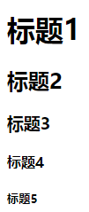
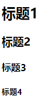
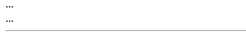
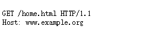

## 前言
今天聊聊HTML的语义化标签。

我相信很多熟悉前端的朋友都在想HTML的构建难道不是一个DIV走天下，加个span双龙戏珠,再加个input标签天下我有吗？这样做行不行呢？毫无疑问答案是行。那这样做好不好呢？按照正确的套路，我应该说不好，但是在很多情况下，答案其实是好。这是因为在现代互联网产品里，HTML 用于描述“软件界面”多过于“富文本”，而软件界面里的东西，实际上几乎是没有语义的。比如说，我们做了一个购物车功能，我们一定要给每个购物车里的商品套上 ul 吗？比如说，加入购物车这个按钮，我们一定要用 Button 吗？实际上我觉得没必要，因为这个场景里面，跟文本中的列表，以及表单中的 Button，其实已经相差很远了，所以，我支持在任何“软件界面”的场景中，直接使用 div 和 span。但是为什么还有语义化规范呢？语义化规范能给我们带来什么呢？

### 什么是语义化以及优点
那么语义化是什么，使用它有什么好处？

语义化是什么？通俗来讲就是指使用恰当语义的html标签、class类名等内容，让页面具有良好的结构与含义，从而让人和机器都能快速理解网页内容，HTML主要负责Web资源的承载体和纽带，也就是说HTML是作为内容的载体，例如人体的骨架。

使用它的好处，正如上面所解释的：
*  用正确的标签做正确的事情
*  html语义化让页面的内容结构化，结构更清晰，便于对浏览器、搜索引擎解析
*  即使在没有样式CSS情况下也以一种文档格式显示，并且是容易阅读的
*  搜索引擎的爬虫也依赖于HTML标记来确定上下文和各个关键字的权重，利于SEO
*  使阅读源代码的人对网站更容易将网站分块，便于阅读维护理解
*  盲人使用读屏器更好地阅读

### 如何“正确”的进行语义化
既然要使用语义化标签，那我们就要用对，很多朋友在最初开始学习使用HTML标签的时候，都习惯性把所有的并列关系使用ul或ol去嵌套，**ul或ol 多数出现正在行文中间，它的上文多数在提示：要列举某些项。但是，如果所有并列关系都用 ul或ol，会造成大量冗余标签**

所以要用就要用对，虽然对于HTML的标准中，没有像JAVASCRIPT那样给我们严格的语法格式，我们可以任意的在HTML中使用各种标签来表达我们想构建的框架。就像我们说话并没有唯一的标准措辞，语义标签的使用也是一样。

简单说一下对于语义使用正确的方式：
对于em和strong我相信大家应该不陌生，一般来说他们都是对语气的加强，且区别在于em 默认用斜体表示，strong 用粗体表示，但使用起来就可以感受到他们的不同。

用一句中文来说：
> 我吃了一个苹果

这是一句很简单的一句话，但是尝试着对其中的单词进行重读会得到不同的意思

> 我吃了\<em>一个\</em>苹果

> 我吃了一个\<em>苹果\</em> 

第一句重读 ‘一个’ 表示我只吃了‘一个’苹果，第二句重读‘苹果’，表示我吃的是‘苹果’

如果说em是表示的内容的重点，那么strong则比em表现出更加强烈的重要性、严重性或内容的紧迫性

我们常用strong来表达给读者最先看到的重要内容，例如w3c中很多教程在题目下面都会有一个加粗的说明：

由此大家应该知道了正确的去使用语义化的重要性，那么接下来我介绍几种比较常用的语义化标签

### 标签介绍

在中国古代小说中有“章 - 回”的概念，而在西方的戏剧也有幕的区分，那么在HTML中也是有如此的一个结构树，通过语义标签来生成一个树目录，我们需要形成一个概念，一篇文档会有一个树形的目录结构，它由各个级别的标题组成。这个树形结构可能不会跟 HTML 元素的嵌套关系一致。
~~~
<h1>标题1</h1>
<h2>标题2</h1>
<h3>标题3</h1>
<h4>标题4</h1>
<h5>标题5</h1>
~~~
通过不同H标签能生成不同层级的标题,告诉读者内容的分层

从 HTML 5 开始，我们有了 section 标签，这个标签可不仅仅是一个“有语义的 div”，它会改变 h1-h6 的语义。section 的嵌套会使得其中的 h1-h6 下降一级，
因此，在 HTML5 以后，我们只需要 section 和 h1 就足以形成文档的树形结构：

~~~
<section>
    <h1>标题1</h1>
    <section>
        <h1>标题2</h1>
        <section>
            <h1>标题3</h1>
            <section>
                <h1>标题4</h1>
            </section>
        </section>
    </section>
</section>
~~~

使用header,nav,aside,footer,article构建一个具有语义化的多文章结构

~~~
<body>
   <header>...</header>
   <article>
       <header>...</header>
       <section>...</section>
       <section>...</section>
       <section>...</section>
       <footer>...</footer>
       </article><article>
   </article>
   <article>
   ...
   </article>
   <footer>
   ...
   </footer>
</body>
~~~

body 里面有自己的 header 和 footer，然后里面是竖篇的 article，每一个 article 里面都有自己的 header、section、footer。这是一个典型的多文章结构。

* header，如其名，通常出现在前部，表示导航或者介绍性的内容。
* footer，通常出现在尾部，包含一些作者信息、相关链接、版权信息等。

* header 和 footer 一般都是放在 article 或者 body 的直接子元素，但是标准中并没有明确规定，footer 也可以和 aside，nav，section 相关联（header 不存在关
联问题）。

* aside 表示跟文章主体不那么相关的部分，它可能包含导航、广告等工具性质的内容。aside 很容易被理解为侧边栏，实际上二者是包含关系，侧边栏是 aside，aside 不一定是侧边栏。
aside 和 header 中都可能出现导航（nav 标签），二者的区别是，header 中的导航多数是到文章自己的目录，而 aside 中的导航多数是到关联页面或者是整站地
图。

* abbr 表示缩写，我们再使用网络地址时输入的www，就是 World Wide Web 的缩写，所以在使用这串缩写时应该使用 abbr 标签
~~~
<abbr title='World Wide Web'>www</abbr>
~~~

* hr 我们经常用hr标签来显示一条分割线，就像这样：

  但是，根据标准定义hr 表示故事走向的转变或者话题的转变，显然此处两个标题并非这种关系，所以我们应该使用 CSS 的 border 来把它当作纯视觉效果来实现，所以这里是不需要用 hr 的。

* blockquote,q,cite  三个跟引述相关的标签blockquote 表示段落级引述内容，q 表示行内的引述内容，cite 表示引述的作品名。

* ol,ul--ol 和 ul 的区分是内容是否有顺序关系，每一项的前面不论是数字还是点，都不会影响语义的判断。所以，你可以注意一下这里，不要因为视觉表现效果，而改变语义的使用

* pre,samp 对于一些非常严格的说明内容时，我们通常***不需要浏览器帮我们做自动换行***，因此使用了 pre 标签，表示这部分内容是预先排版过的，不需要浏览器进行排版。
~~~
<pre><samp>
GET /home.html HTTP/1.1
Host: www.example.org
</samp></pre>
~~~

又因为这是一段计算机程序的示例输出，所以我们可以使用 samp 标签

以上介绍了目前HTML所带的部分语义化标签，其他的标签s,i,b,u,data,time，main等等还有很多的其他语义化标签，可以到[runoob](https://www.runoob.com/tags/html-reference.html)里面查到

事实上由于HTML并不是一门严格或说是严谨的编程语言，我们可以自由的进行HTML结构搭建，写下这篇文章也不是说在写HTML的时候，全部使用语义化标签，因为在使用一些标签时会引来大量的争议，所以我们尽可能使用我们熟悉且有把握的语义标签。