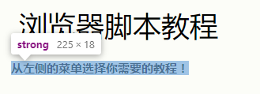

## 前言
今天聊聊HTML的语义化标签。

我相信很多熟悉前端的朋友都在想HTML的构建难道不是一个DIV走天下，加个span双龙戏珠,再加个input标签天下我有吗？这样做行不行呢？毫无疑问答案是行。那这样做好不好呢？按照正确的套路，我应该说不好，但是在很多情况下，答案其实是好。这是因为在现代互联网产品里，HTML 用于描述“软件界面”多过于“富文本”，而软件界面里的东西，实际上几乎是没有语义的。比如说，我们做了一个购物车功能，我们一定要给每个购物车里的商品套上 ul 吗？比如说，加入购物车这个按钮，我们一定要用 Button 吗？实际上我觉得没必要，因为这个场景里面，跟文本中的列表，以及表单中的 Button，其实已经相差很远了，所以，我支持在任何“软件界面”的场景中，直接使用 div 和 span。但是为什么还有语义化规范呢？语义化规范能给我们带来什么呢？

### 什么是语义化以及优点
那么语义化是什么，使用它有什么好处？

语义化是什么？通俗来讲就是指使用恰当语义的html标签、class类名等内容，让页面具有良好的结构与含义，从而让人和机器都能快速理解网页内容，HTML主要负责Web资源的承载体和纽带，也就是说HTML是作为内容的载体，例如人体的骨架。

使用它的好处，正如上面所解释的：
*  用正确的标签做正确的事情
*  html语义化让页面的内容结构化，结构更清晰，便于对浏览器、搜索引擎解析
*  即使在没有样式CSS情况下也以一种文档格式显示，并且是容易阅读的
*  搜索引擎的爬虫也依赖于HTML标记来确定上下文和各个关键字的权重，利于SEO
*  使阅读源代码的人对网站更容易将网站分块，便于阅读维护理解
*  盲人使用读屏器更好地阅读

### 如何“正确”的进行语义化
既然要使用语义化标签，那我们就要用对，很多朋友在最初开始学习使用HTML标签的时候，都习惯性把所有的并列关系使用ul或ol去嵌套，**ul或ol 多数出现正在行文中间，它的上文多数在提示：要列举某些项。但是，如果所有并列关系都用 ul或ol，会造成大量冗余标签**

所以要用就要用对，虽然对于HTML的标准中，没有像JAVASCRIPT那样给我们严格的语法格式，我们可以任意的在HTML中使用各种标签来表达我们想构建的框架。就像我们说话并没有唯一的标准措辞，语义标签的使用也是一样。

简单说一下对于语义使用正确的方式：
对于em和strong我相信大家应该不陌生，一般来说他们都是对语气的加强，且区别在于em 默认用斜体表示，strong 用粗体表示，但使用起来就可以感受到他们的不同。

用一句中文来说：
> 我吃了一个苹果

这是一句很简单的一句话，但是尝试着对其中的单词进行重读会得到不同的意思

> 我吃了\<em>一个\</em>苹果

> 我吃了一个\<em>苹果\</em> 

第一句重读 ‘一个’ 表示我只吃了‘一个’苹果，第二句重读‘苹果’，表示我吃的是‘苹果’

如果说em是表示的内容的重点，那么strong则比em表现出更加强烈的重要性、严重性或内容的紧迫性

我们常用strong来表达给读者最先看到的重要内容，例如w3c中很多教程在题目下面都会有一个加粗的说明：

由此大家应该知道了正确的去使用语义化的重要性，那么接下来我介绍几种比较常用的语义化标签