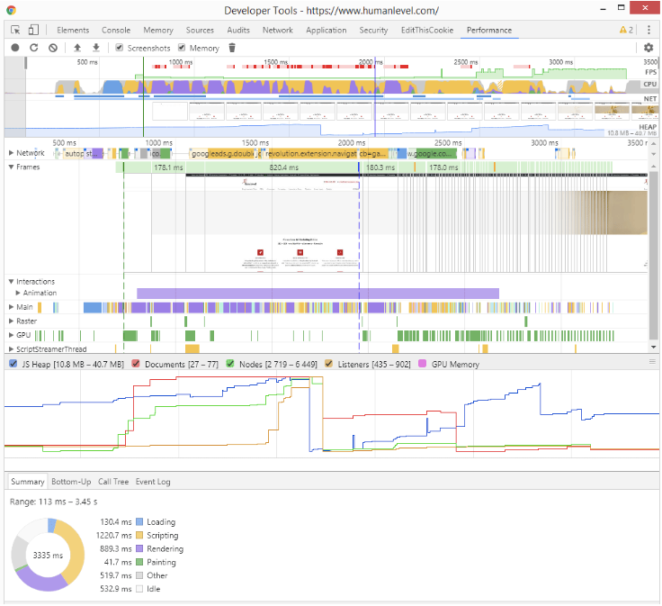
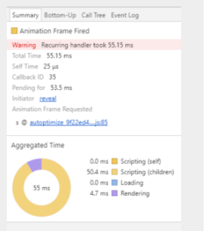

>原文链接: [原文](https://nodesource.com/blog/improve-javascript-performance)  
>原文作者:Liz Parody  
>翻译人:孤香远

## 提升JS性能的12个技巧

提升性能是我们在创建一个网页或是应用时最看重的一个方面，没有人想要一个时常崩溃的应用和一直加载不出来的网页，以及用户等待的时间不会太长（没明白他这句是什么意思，我想他这里应该是想说等待时间过长），据Kissmetrics称，47％的访问者希望网站在不到2秒的时间内加载，如果加载过程超过3秒，40％的访问者将离开网站。

考虑到以上的数字，在创建Web应用程序时应始终考虑到性能。为了帮助你入门，以下14（？？哪来的14个）个方法能够有效的提高程序性能：

#### 1.使用浏览器缓存

这有两种做法，第一使用js的缓存API，我们可以通过安装service worker来使用它，第二种是使用HTTP协议缓存。

脚本通常用于访问某个对象，通过在用户自定义的变量中存储重复访问的对象，以及在后续对该对象的引用中使用变量，可以立即实现性能提升。（这个技巧简而言之就是使用缓存以及存储需要重复使用的对象，不知道service worker的看这里（[serviceWorker](https://www.jianshu.com/p/08c0fdec31b4)））

#### 2.定义执行上下文
为了有效的测量您在计划中加入的任何改进，您必须建立一套定义良好的环境，以便测试代码的性能。

尝试对所有JS引擎的所有版本进行性能测试和优化在实践中是不可行的。但是在一个单一的环境下进行测试并不是一个好的习惯，因为这将会给你带来一个片面的结果。因此，建立多个定义良好的环境并测试代码是否适用于它们非常重要。（定义一套测试环境很重要）

#### 3.移除不重要的JS代码
这个技巧不仅会缩短传输时间，还会缩短浏览器分析和编译代码所需的时间。为此，你必须考虑以下几点： 

* 如果您检测到用户未使用的功能，最好删除其所有相关的JS代码，这样网站的加载速度会更快，用户也会有更好的体验。
* 这也有可能是错误的包含了不必要的库，或者你的依赖库提供的一些早已在所有浏览器中实现的功能，而无需使用其他代码。

（简单来说就是删除用不上的功能代码，虽然现在都是使用打包工具按需加载，但是我们在工作中不免会有因为需求的更改而弃用的函数，这些都是垃圾代码都是需要删除的）
#### 4.避免使用太多内存
你应该总是试着将内存使用限制在绝对必要的范围内，因为无法知道运行你的程序需要占用多少的设备内存空间。任何时候你的代码在请求浏览器存储新内存时，就会执行浏览器的垃圾回收器，并将停止JS。 如果经常发生这种情况，页面将运行的很慢。

#### 5. 推迟不必要的JS加载
用户希望看到页面快速加载，但是所有功能都不可能在页面初始化的时候进行加载。如果一个用户需要执行某个操作才能执行某个功能(e.g. 通过点击一个element, 或是改变tabs),那么就可以推迟加载该功能直到页面初始化之后。

用这种方式，你可以避免因加载和编译JS代码所导致页面初始化延迟显示的情况，档一个页面完全加载完后，我们就可以加载这些功能，以便用户在进行交互时能立即使用。在RAIL模型中，Google建议将此延迟加载以50毫秒为单位进行，这样就不会影响用户与页面的交互。（将一些交互功能放到页面加载之后，能够迅速提高页面的显示速度）

如果发生内存泄漏，加载的页面将保留越来越多的内存，最终占用设备的所有可用内存，严重影响性能。您可能已经看到（并且可能对）这种类型的失败感到沮丧，可能是在带有旋转木马或图像滑块的页面上。
您可能已经看到（并且可能对此类故障感到沮丧），可能是在带有旋转木马或图像滑块的页面上。
#### 6.避免内存泄漏
如果发生内存泄漏，加载的页面将会存储越来越多的内存，最终会占用设备所有的可用内存，严重影响性能。你可能已经看到（并且可能）对此类错误感到沮丧，可能会出现旋转木马或轮播图中。

在Chrome开发者工具中，你可以通过Performance标签中的时间线记录来分析你的网站是否存在内存泄漏。通常，内存泄漏来自于从页面中删除一些DOM，但是还有一些引用它们的变量，因此，垃圾收集器无法消除它们。（一些对JS使用不当的方式也会造成内存泄漏，例如大量使用闭包和递归的时候）

#### 7.当你需要大量的执行时间去执行代码时，请使用Web worker
根据Mozilla开发人员网络（MDN）文档上的描述：通过使用Web Workers，Web应用程序可以在独立于主线程的后台线程中，运行一个脚本操作。

Web workers允许你的代码执行处理复杂的计算，而不会阻塞用户界面的线程。Web Workers允许你生成新线程并将工作委托给这些线程以获得更高的性能。这样，需长时间运行的任务通常会阻止其他任务被传递给worker，而主线程可以在不被阻止的情况下运行。（运用Web Workers开启另一个线程来运行需要花费大量时间的代码，来提高界面的运行速度）

#### 8.如果多次访问DOM项，请将其保存在局部变量中
访问DOM是很慢的。如果你是需要多次读取元素节点中的内容，最好的方式是将它存储到局部 变量中，但是需要重点去记住，如果你稍后去删除了DOM值，那么应将变量设为‘null’，这样就不会导致内存泄漏。

#### 9.优先访问局部变量
JS首先会搜索查看变量是否在本地，然后在提高搜索范围逐步到全局变量。将变量保持到本地范围允许JS更快的访问它们。

局部变量是根据最具体的范围找到的，并且能穿过多个作用域，查找操作的结果为一般查询出来的结果。档定义函数作用域时，其内部局部变量在前面没有定义时，使用let和const声明变量以便定义作用域，来加快代码的查找速度。 （尽量使用局部变量，且使用let和const定义块级作用域）

#### 10.避免使用全局变量
由于当从函数或其他范围内引用全局变量时脚本引擎需要查找范围，当本地范围丢失时，该变量将被销毁。如果全局范围中的变量无法在脚本的生命周期中持续存在，那么性能将得到提高。
#### 11. 你可实行在任何编程语言中的优化
* 始终使用最佳数据结构以及计算复杂度最低的算法来解决任务
* 重写算法得到相同的结果以及更少的计算
* 避免递归调用
* 输入变量，计算和调用重复的函数
* 简化数学公式
* 使用查询数组：它们用于获取基于另一个数组的值，而不是使用switch/case语句
* 将条件总是设置为合适的true，能更好地利用处理器的模拟执行
* 如果你可以替换某些操作，请使用位级运算符，因为这些运算符使用较少的处理器周期

#### 12.使用工具来检测问题

Lighthouse是一个很好的网页性能工具，它可以帮助你审核性能，可访问性，最佳实践和SEO。Google PageSpeed旨在帮助开发人员了解网站的效果优化和潜在改进领域。这些组件用于识别网站是否符合谷歌的网络性能最佳实践，以及自动调整过程。

在Chrome中，你还可以使用主菜单中的“More Tools”选项查看每个选项卡使用的内存和CPU。对于更高级的分析，你可以使用firefox或chrome中的developer tools性能视图来分析不同的指标，例如：

devtools的性能分析允许你在加载页面时模拟CPU消耗，网络和其他指标，以便你可以识别和修复问题。

为了更深入的了解，建议使用JavaScript Navigation Timing API，它允许你详细测试从编程本身中的每部分代码。

对于基于Node.js构建的应用程序，NodeSource Platform也是一种非常好，低影响的方式去探索颗粒级的程序性能。

全面的Node.js指标可帮助你识别内存泄漏源或其他性能问题，并更快地解决这些问题。

#### 结语

在代码的可读性和优化之间保持平衡很重要。 代码由计算机解释，但我们需要确保将来可以由我们自己或其他人维护，因此代码需要能被看懂。

请记住：应始终考虑性能，但不应超过检测错误并添加功能。

