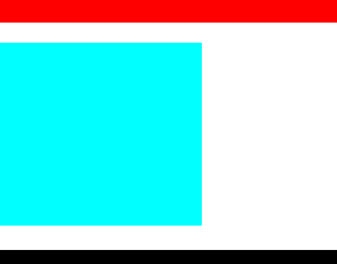
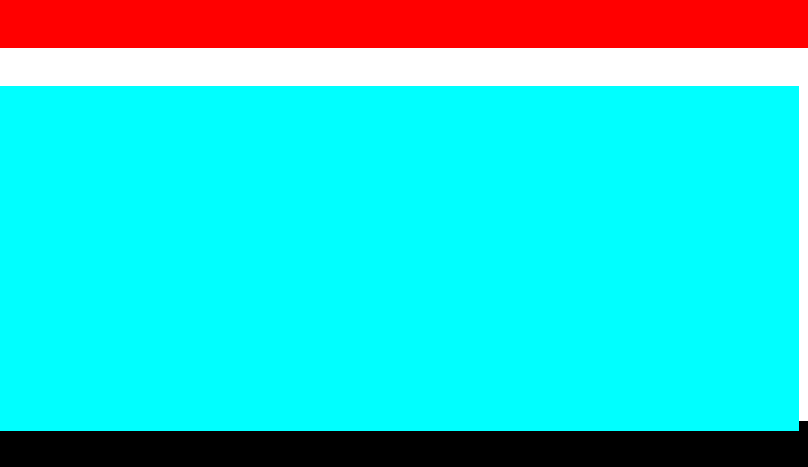
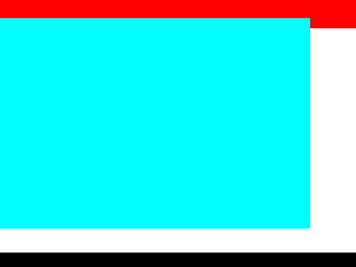
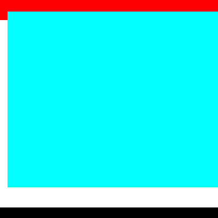
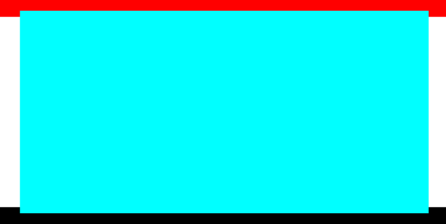

# 使用定位来改变DIV的宽高伸缩方向

我们经常使用 transform-origin 来对元素的原点进行定位，再使用transform的一些CSS属性就能轻而易举的达到我们对动画的需求。

但是依然有局限性，遇到这样一个需求，给定一个DIV宽高，然后我们想对他进行高度或宽度的改变并带有动画


然后我们对他进行宽度或高度的改变，没问题，设置宽高后如图：


一切都很正常，但是我们换一个需求呢，我们要求改变高度，
但是需要蓝色盒子高度向上延伸到红色边框处，
下面依然要求和黑色框有一段间隙，
这个时候如果我们使用transform-origin来进行动画原点的设置是不起任何作用，
至于原因就跟我所说的是对动画原点进行设置，是对动画的原点，而我们设置的宽高并不是
使用动画属性去进行改变，所以设置transform-origin并不会起任何作用，当然transform
中也有改变DIV大小的属性如 scale，但是设置这个属性会发生一些我们不愿意看到的现象

接下来介绍我们的主角---position，这个属性是我们经常在编写前端页面要使用的一个
元素定位方式，它的定位方式有很多，这里就不一一赘述了。

我们给定中间蓝色盒子position:absolute,然后对它进行定位设置,直接设置bottom

```
.blue{
   position: absolute;
   width: 800px;
   height: 300px;
   background-color: aqua;
   bottom: 120px;
}
```
这个时候再进行高度的设置，我们发现盒子是往上延伸的



我们再来改改其他属性
```
/*改变宽盒子宽度会向左延伸，改变盒子高度会向上延伸*/
.blue{
   position: absolute;
   width: 800px;
   height: 300px;
   background-color: aqua;
   bottom: 120px;
   right:0;
}
```


我们也可以将变化的原点设置到盒子的中心，这样改变宽或高时，会同时增加两边的高度

```
/*改变宽盒子宽度会向左延伸，改变盒子高度会向上延伸*/
.blue{
    position: absolute;
    top: 0;
    bottom: 0;
    left: 0;
    right: 0;
    margin: auto;
    width: 800px;
    height: 300px;
    background-color: aqua;
}
```



当然如果需要设置的原点比较特殊，这种方法就不适用了，毕竟特殊情况特殊分析