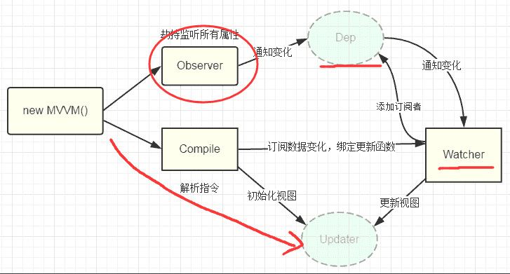

## 前端MVVM模式从理论到实战 （七）

### 数据绑定

上几节完成了对视图的初始化，但就目前来说都仅仅是静态的，在改变其data内的数据时，视图还不能实时更新，所以接下来就是比较复杂的数据绑定

数据绑定是当我们更新某一个数据时，其在视图上引用或间接引用的数据能够实时的被更新

那么如何去实现数据绑定呢？

先来看看第二章我放的图，在上面那条线中我们可以看到通过劫持监听属性的变化来通知监听者更新视图，通俗来说就是把数据的改变，在setter的时候就给截停了，然后做一些处理再通知视图做更新。当然底层不可能这么简单，在最开始时我们将data中的数据代理到了MvvmVue,数据的一切的改变都会先走MvvmVue中的setter或getter，然后在setter或getter中再去对data中的某个数据进行更新.

所以MvvmVue仅仅是数据代理，而最终做数据处理的还是data中的setter或getter

也就是说如果要实现数据绑定，需要通过数据劫持去做

那么就需要对data中的数据进行监视

#### Observer
目前已经理清楚了我们的需求，先对data中的所有数据进行数据劫持

~~~
//dataProxy.js
// 在MvvmVue函数中将数据传给observe
function MvvmVue(options) {
    this.$options = options // 得到传过来的配置
    var data = this._data = this.$options.data // 得到配置里面的data对象
    var _self = this // 保存this对象
    // 遍历属性对象JSON
    Object.keys(data).forEach(function (key) {
        // 实现属性代理
        _self._proxy(key)
    })
    // 进行所有数据监听
    observe(data)

    // 编译HTML模板
    this.$compile = new Compile(_self.$options.el || document.body, _self)
}
~~~

新建一个observer.js文件

定义一个Observer类，主要是对数据做监听
~~~
// observer.js
// 检查数据是否符合监测对象
function observe (data){
    // value必须是对象, 因为监视的是对象内部的属性
    if (!data || typeof data !== 'object') {
        return
    }
    // 使用Observer对象，处理数据
    new Observer(data)
}
// 定义Observer对象
function Observer(data) {
    this.data = data
    this.start(data) // 对数据进行监视
}
// 扩展Observer函数
Observer.prototype = {
    // 开始对数据进行监测
    start(data){
        var _self = this
        // 对该对象进行遍历
        Object.keys(data).forEach(function (key) {
            // 拿到key值和value值，进行监测
            _self.convert(key,data[key])
        })
    },
    convert(key, value){
        // 对指定属性实现响应式数据绑定
        this.defineReactive(this.data, key, value);
    },
    defineReactive(data, key,val){
        // 间接性的递归，监测更深层次的数据
        var childObj = observe(val);
        // 给data重新定义属性(添加set/get)
        Object.defineProperty(data,key,{
            enumerable: true, // 可枚举
            configurable: false, // 不能再define
            get(){
                return val
            },
            set(newVal){
                if(newVal === val){
                    return
                }
                val = newVal
                // 如果新值是一个对象的话就再进行监测
                childObj = observe(newVal)
            }
        })
    }
}
~~~

上面的代码对data数据进行了defineProperty，data中所有的数据对象进行了getter和setter监听，在这里需要注意的一点是为了拿到data中深层次的对象，通过类似于递归（但只是对数据进行处理并不是真正的递归）的方式去监视更深层次的数据，其他代码都比较简单就不做过多的赘述

#### Dep以及watcher

如图画圈和箭头的是已经完成的，对于dep和watcher对象是什么，它是做什么的，需要深入的去解析

从图上来看，在observer监听中如果有改变就会去通知Dep数据有变化，在Dep中数据有变化就会去通知watcher数据有变，然后watcher再去进行一个视图更新

另外还有一个步骤是从Compile编译阶段到watcher，这是需要把模板上所有指令绑定的属性值在watcher中做一个存储，接着再去dep对象中添加订阅者也就是将多个watcher存储到dep中去，然后如果有更新就通过dep去发布通知多个watcher有更新

##### Dep是什么？

  Dep作为一个发布订阅中的发布者，肩负的是当数据有了更新就发布个通知，有数据更新啦，watcher快去更新视图...
  
  从代码层面看，就是data数据中每一个数据对象，包括其更深层次的所有对象，每一个对象即对应一个Dep
~~~
// 例如
data:{
x:0, // 对应Dep1对象
y:{ // 对应Dpe2对象
    z:3 // 对应Dep3对象
  }
}
~~~
 
 其作用就是如果其中某一个数据对象发生了改变，那么其对应的Dep对象就应该被告知数据被改变了，然后通知watcher更新
 
 
##### watcher是什么？
  
  如上，watcher作为一个订阅者，在收到dep发布的通知时，会立刻去更新视图
  
  从代码层来看，watcher对象的创建时机应该是在模板编译阶段，在对指令或是双括号进行编译解析时，会得到一些数据对象，这时每一个指令或双括号都应该对应一个watcher对象，用来监听数据的更新
  
 ~~~
 // 例如
 {{name}} // 对应一个watcher对象
 {{fruit.apple}} // 对应一个watcher对象
 v-text='name' // 对应一个watcher对象
 @click='change' // 对应一个watcher对象
 ~~~
##### Dep和watcher的关系

一个Dep对象可能存储多个watcher对象，这是因为一个数据可能用在多个指令或模板内，如上{{name}}和v-text='name'，那么Dep就需要通知多个watcher进行更新

一个watcher对象可能存储多个dep对象，这是因为可能会出现如上面fruit.apple这样的情况，在 Dep是什么中 有写，每一个数据对象即对应一个Dep对象，这时需将fruit.apple拆成fruit和apple两个dep来看，那么就需要在fruit和apple的Dep中分别去存储这个watcher，这样不管是fruit更新，还是apple更新，都会去触发这个watcher去更新，避免了该对象的上层更新而没有通知到下一层对象的更新

目前理清楚了Dep和Watcher是什么以及其复杂的关系，那么在Dep对象中应该有通知和存储watcher功能，在Watcher对象中有存储dep和视图更新功能，接下来就可以开始写代码了

