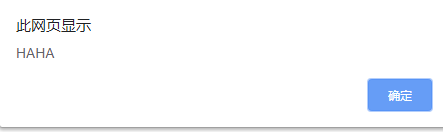

## 前端MVVM模式从理论到实战 （六）

### 模板解析 
> * 解析双括号   
> * v-on绑定事件   
> * v-text绑定事件   
> * v-class绑定事件   
> * v-html绑定事件  
> * v-model绑定事件 

上一章讲了双括号的解析，接下来开始对事件指令进行讲解

#### v-on指令
先初始化代码

~~~

    {{title}}
    <button v-on:click='showInfo'>点我</button>

~~~

要做的就是事件绑定，当点击button时，会弹出 haha 的信息

首先要明确的一点是在button元素上，添加诸如class，id这些都是一个元素节点上的属性，以及可以自定义些属性比如num,index这些也属于是属性，而对于属性可以通过节点的attributes属性就能轻松的获取到所有的属性，当然只取所需要的属性。

在上一节，定义了模板编译函数compileFrag，在里面只是对一个元素节点的文本内容进行了解析和编译，那么继续对该函数进行扩展，让它支持事件和一般指令的解析。

~~~
...
// 进行模板编译
Compile.prototype.compileFrag=function (el){
    // 拿到节点中的第一层所有子节点
    var childNodes = el.childNodes
    var _self = this
    Array.prototype.slice.apply(childNodes).forEach(function (node) {
        // 正则找 {{}} 需要拿到里面的字符串
        var reg = /\{\{(.*)\}\}/
        // 判断是否是元素节点
        if(_self.isElement(node)){
            // 查看绑定的指令
            // 这里对v-指令进行解析和编译
            ...
            // 判断是否是文本且节点的内容能否匹配上正则
        } else if(_self.isText(node) && reg.test(node.textContent)){ 
            // 编译大括号模板
            _self.compileText(node, RegExp.$1)

        }
        // 如果子节点还有子节点
        if (node.childNodes && node.childNodes.length) {
            // 调用实现所有层次节点的编译
            _self.compileFrag(node);
        }
    })
}
// 判断传过来的是否是node节点
Compile.prototype.isElement = function (node){
    return node.nodeType == 1 // 如果是1的话就是标签
}
...
~~~

同大括号解析一样，再创建一个 compileV 函数来专门对v-指令进行一个解析和编译，该函数相对来说比较复杂，先从解析事件v-on开始

~~~
...
if(_self.isElement(node)){
    // 查看绑定的指令
    // 这里对v-指令进行解析和编译
    _self.compileV(node)
}
...
~~~

~~~
...
// 对指令进行编译
Compile.prototype.compileV = function (node){
// 接收上面传来的node节点
    var _self = this
    var vm = this._vm
    var attrs = node.attributes // 得到该node的所有的属性

    // 遍历该属性数组
    Array.prototype.slice.apply(attrs).forEach(function (attr) {
        // 得到指令名字符串 如:v-on:click
        var attrName = attr.name
        // 判断是否有指令属性
        // 这里把 @ 的写法考虑进去
        if(attrName.indexOf('v-') === 0 || attrName.indexOf('@') === 0 ){

            var attrValue = attr.value.trim() // 得到属性的值
            // 由于事件绑定的处理和其他的指定绑定处理不一样所以分开处理
            console.log(attrName.indexOf('v-'))
            // 这里对属性字符串进行了一次截取，也可以不用截取但是全等后面数字要变成2
            if(attrName.substring(2).indexOf('on')===0 || attrName.indexOf('@') === 0){
                // 事件绑定
                ....
            }
            // 最后移除该指令在node上
            node.removeAttribute(attrName)
        }
    })
}
...
~~~
上面主要是对属性的一个辨别和分析，然后需要处理的就是分辨该指令是什么事件的指令，这里就需要对使用该指令的节点进行事件绑定，这就涉及到了原生的事件绑定,**注意，最后使用了removeAttribute将属性从节点上删除，这是因为在使用vue的时候，处于安全考虑，也不会把一些指令属性留下来**

~~~
...
// 对指令进行编译
Compile.prototype.compileV = function (node){
    var _self = this
    var vm = this._vm
    var attrs = node.attributes // 得到该node的所有的属性

    // 遍历该属性数组
    Array.prototype.slice.apply(attrs).forEach(function (attr) {
        // 得到指令名字符串 如:v-on:click
        var attrName = attr.name
        // 判断是否有指令属性
        if(attrName.indexOf('v-') === 0 || attrName.indexOf('@') === 0 ){

            var attrValue = attr.value.trim() // 得到属性的值
            // 由于事件绑定的处理和其他的指定绑定处理不一样所以分开处理
            console.log(attrName.indexOf('v-'))
            if(attrName.substring(2).indexOf('on')===0 || attrName.indexOf('@') === 0){

                // 事件绑定
                // 在这里做安全判断
                // 需要判断的是属性值，data中是否有methodes声明，以及是否有匹配的函数
                if(attrValue && vm.$options.methodes && vm.$options.methodes[attrValue]){
                    // 另外写一个函数进行事件绑定
                    // 进行函数绑定
                    _self.handelFn(node, attrName, vm.$options.methodes[attrValue])
                }
            }

            // 最后移除该指令在node上
            node.removeAttribute(attrName)
        }
    })

}
...
~~~

编写事件绑定，这个很简单
~~~
...
// 进行回调绑定
Compile.prototype.handelFn = function (node, fnType, fn){
    if(fnType.indexOf('v-') === 0 ){
        var fnType = fnType.split(':')[1]
    } else if( fnType.indexOf('@') === 0 ){
        var fnType = fnType.split('@')[1]
    }
    // 这里进行函数绑定
    // 注意这里需要对fn进行bind修改this指向，并且把this指向MvvmVue实例对象，否则该fn的this指向的是事件绑定者
    node.addEventListener(fnType, fn.bind(this._vm) ,false)
}
...
~~~

最后来点击一下，button按钮

成功弹出，解析成功

#### 一般指令
> * v-text指令  
> * v-class指令  
> * v-html指令

这几个指令就一起写吧，大体都差不多

gogo！！

初始化代码

~~~

    
    
    

~~~

哦K，回到之前的compileV函数，在这个函数里面，主要是对节点的属性进行一个解析，但是只对v-on指令的解析和事件绑定，接下来继续从这个函数入手，由于处理方式和v-on不同，所以单独来解析上面几个指令

~~~
...
// 对指令进行编译
Compile.prototype.compileV = function (node){
    var _self = this
    var vm = this._vm
    var attrs = node.attributes // 得到该node的所有的属性

    // 遍历该属性数组
    Array.prototype.slice.apply(attrs).forEach(function (attr) {
        // 得到指令名字符串 如:v-on:click
        var attrName = attr.name
        // 判断是否有指令属性
        if(attrName.indexOf('v-') === 0 || attrName.indexOf('@') === 0 ){

            var attrValue = attr.value.trim() // 得到属性的值
            // 由于事件绑定的处理和其他的指定绑定处理不一样所以分开处理
            console.log(attrName.indexOf('v-'))
            if(attrName.substring(2).indexOf('on')===0 || attrName.indexOf('@') === 0){

                // 事件绑定
                // 在这里做安全判断
                if(attrValue && vm.$options.methodes && vm.$options.methodes[attrValue]){
                    // 进行函数绑定
                    _self.handelFn(node, attrName, vm.$options.methodes[attrValue])
                }
            } else {
                // 处理其他指令
                ...
            }
            // 最后移除该指令在node上
            node.removeAttribute(attrName)
        }
    })
}
...
~~~

还记得上一章声明的工具函数vUtil吗，指令的处理就全权交给它来处理

首先，能明确一点的是，通过compileV解析，能够知道指令名，绑定的节点以及指令上的值，知道这些就好做了，不外乎就是解析值然后再从data中拿值，然后根据相应的指令进行处理

~~~
// 接收三个参数
// vm实例 为了拿到data的值
// node节点
// value指令上的值
Compile.prototype.vUtil = {
    // v-text
    text: function (vm, node, value) {
    // 同样用到了getDataValue来拿data里面的值
       node.textContent = this.getDataValue(vm,value) ? this.getDataValue(vm,value)  : ''
    },
    // v-html
    html:function (vm, node, value) {
        node.innerHTML = this.getDataValue(vm,value) ? this.getDataValue(vm,value) : ''
    },
    // v-class
    class: function (vm, node, value) {
        var nodeClass = node.className
        // 对class进行赋值的时候需要考虑其自身已经定义的class
        node.className = nodeClass? nodeClass+ ' ' + this.getDataValue(vm,value):this.getDataValue(vm,value);
    },
    // 得到{{}}中指定的数据，从实例中得到
    getDataValue: function (vm, regStr){
        var val = vm._data
        regStr = regStr.split('.')
        regStr.forEach(function (k) {
            val = val[k]
        })
        return val
    }
}
~~~

上面的代码已经能能够解析这三种指令，但是我希望每个函数里面的功能尽量少且最好是一个函数只做一件事情，所以做一些优化，增加两个函数

~~~
Compile.prototype.vUtil = {
    // v-text/ {{}}
    text: function (vm, node, value) {
        this.deal(vm, node, value, 'text')
    },
    // v-html
    html:function (vm, node, value) {
        this.deal(vm, node, value, 'html')
    },
    // v-class
    class: function (vm, node, value) {
        this.deal(vm, node, value, 'class')
    },
    // 这个函数统一进行指令的处理
    deal: function (vm, node, value, type) {
        var _self = this;
        // 这里需要处理不同的指令
        this.dealTypeFn[type+'Updata'] && this.dealTypeFn[type+'Updata'](node, this.getDataValue(vm,value))
    },
    dealTypeFn:{
        textUpdata: function (node,value) {
            node.textContent = value ? value  : ''
        },
        htmlUpdata: function (node, value) {
            node.innerHTML = value ? value : ''
        },
        classUpdata: function (node, value) {
            var nodeClass = node.className
            node.className = nodeClass? nodeClass+ ' ' + value:value;
        }
    },
    getDataValue: function (vm, regStr){
        var val = vm._data
        regStr = regStr.split('.')
        regStr.forEach(function (k) {
            val = val[k]
        })
        return val
    }
}
~~~

执行下初始代码，如下图

所有指令都能正确的取到data里的数据，目前除了v-model，一般指令和事件指令都已解析成功，由于v-model涉及到了双向数据绑定，所以后面会写详细去写。

...还没有完，做一些代码优化，在上一章在对双括号进行解析赋值时用的compileText函数，不过我们是在函数内部直接对node.textContent进行的赋值，这一章里面在vUtil函数里命名了多个指令解析函数，其中text的功能完全可以复用到双括号的解析上，那么把compileText修改一下

~~~
// 对文本节点进行赋值
Compile.prototype.compileText = function (node, regStr){
    // 得到相对应的数据，然后进行内容填充
    this.vUtil.text(this._vm, node, regStr) // 使用text来进行赋值
    // node.textContent = this.vUtil.getDataValue(this._vm, regStr)
}
~~~

哦K，那么接下来就是数据绑定了....