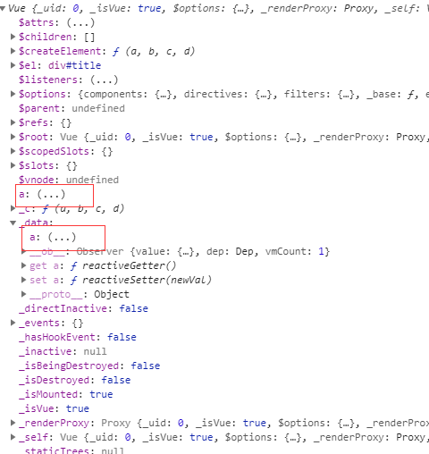
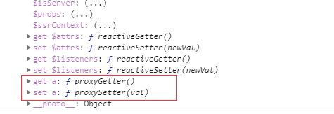
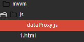
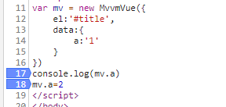
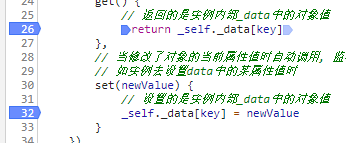

## 前端MVVM模式从理论到实战 （四）

### 前言
终于能抽点时间出来继续写这个系列的文章了（其实是因为懒╭(╯^╰)╮,还有就是时间拉的有点长，其实代码早就写好了...就是有点忘了以前实现的细节了，最近有把代码捋了一遍），接下来几节会开始进行实战（随性的更新），还有请看完我前两节再来看实战，不然有些代码会看的很蒙。

我们会模仿VUE进行简单的包括数据代理绑定以及模板解析功能的实现，当然和VUE的源码还是有很大的区别的，我们只是去试着实现一下原理，虽然简单但是会让你体会到写框架你上你也行的感觉┗( ▔, ▔ )┛。

目标：
* 数据代理    
* 模板解析 
> * 解析双括号   
> * v-on绑定事件   
> * v-text绑定事件   
> * v-class绑定事件   
> * v-html绑定事件  
> * v-model绑定事件   
* 数据绑定 
> * 数据拦截  
> * 订阅发布  

大部分代码都是ES5，并且尽量每一行代码都写上注释，方便大家都能看懂

### 数据代理

我们先来new一个vue实例,然后在data里面给个值
~~~
var vm = new Vue({
    el:'#title',
    data:{
        a:'1'
    }
})
~~~
我们知道vue遵守MVVM模式，当我们改变a数据时，view上的a数据也会跟着改变，我们再来看看vue的实例,
在最外层的对象和_data上都绑定的有一个a数据，当我们把鼠标放在（...）上时，会显示一个invoke property getter的提示，意思是这个数值会通过getter来进行获取，我们在data里面定义的数据被存储到了_data对象里面，至于为什么，后面会讲到

我们往下看在这里有两个函数分别对应a数据的代理set和代理get函数

~~~
console.log(vm.a) //其实是在调用a的代理getter函数
vm.a=2 // 其实在调用a的代理setter函数
~~~
在这里有一个疑问，我们明明把a数据定义在data对象里面的，但为什么我们可以通过vm直接对a进行读写操作呢？

这就是所谓的数据代理，我们通过vm对data里面的数据进行代理操作，而不是直接去对data里的数据进行操作

接下来我们开始模仿实现数据代理
~~~
// 我们的初始化对象MvvmVue
var mv = new MvvmVue({
    el:'#title',
    data:{
        a:'1'
    }
})
~~~
然后新建一个dataProxy.js文件，目录如下

新建一个MvvmVue对象，并模仿vue存放数据
~~~
// dataProxy.js
function MvvmVue(options) {
    this.$options = options // 得到传过来的配置,并存到$options对象
    var data = this._data = this.$options.data // 得到配置里面的data对象，并存到_data
    var _self = this // 保存this对象
    // 遍历属性对象JSON
    Object.keys(data).forEach(function (key) {
        // 实现属性代理
        ...
    })
}
~~~
上面的代码都很好理解，比较重要的一点就是我们会围绕着MvvmVue这个类进行实现，数据都存放完毕，我们将需要代理的数据，也就是传入到MvvmVue对象里的数据，使用Object.keys的方式循环调用代理函数来进行数据代理
~~~
// dataProxy.js
function MvvmVue(options) {
    this.$options = options // 得到传过来的配置,并存到$options对象
    var data = this._data = this.$options.data // 得到配置里面的data对象，并存到_data
    var _self = this // 保存this对象
    // 遍历属性对象JSON
    Object.keys(data).forEach(function (key) {
        // 实现属性代理
        _self._proxy(key) // 调用_proxy函数，进行数据代理
    })
}
~~~
_proxy函数的实现，这里说一下，虽然JS没有私有属性和函数的说法，但是一般默认加 _ 线的为私有属性或函数。

~~~
// dataProxy.js
//这里使用原型链添加函数
MvvmVue.prototype._proxy = function (key) {
    var _self = this // 保存this对象，即MvvmVue对象
    // 这里用到了之前我们重点说的defineProperty函数，我们数据代理就全靠它来实现
    // 将需要代理的对象名添加到对象实例上，并定义得到方式
    Object.defineProperty(_self, key, {
        configurable: false, // 不能再重新定义
        enumerable: true, // 可以枚举
        // 当读取对象此属性值时自动调用, 将函数返回的值作为属性值, this为实例对象
        // 如实例去获取data中的某属性时
        get() { //getter
            // 返回的是实例内部_data中的对象值，拿取得是_data中的数据
            return _self._data[key]
        },
        // 当修改了对象的当前属性值时自动调用, 监视当前属性值的变化, 修改相关的属性, this为实例对象
        // 如实例去设置data中的某属性值时
        set(newValue) { //setter
            // 设置的是实例内部_data中的对象值
            _self._data[key] = newValue
        }
    })
}
~~~

这个时候我们已经有了数据代理，当我们对data里面的值进行取值或设置值得时候都会走上面的getter和setter函数
~~~
console.log(mv.a) //其实是在调用a的代理getter函数
mv.a=2 // 其实在调用a的代理setter函数
~~~

一个比较直观的，观察方式是F12，在代码上打断点，然后跟着一步一步走，你们就会很清楚代码的运行顺序了

数据代理其实很简单难点在接下来的模板解析和数据绑定

