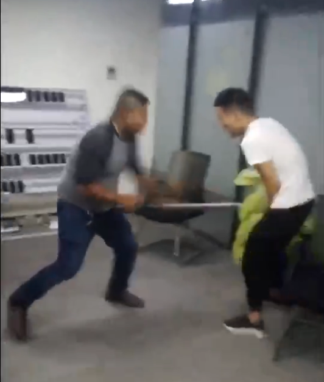
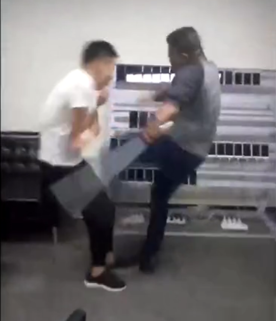
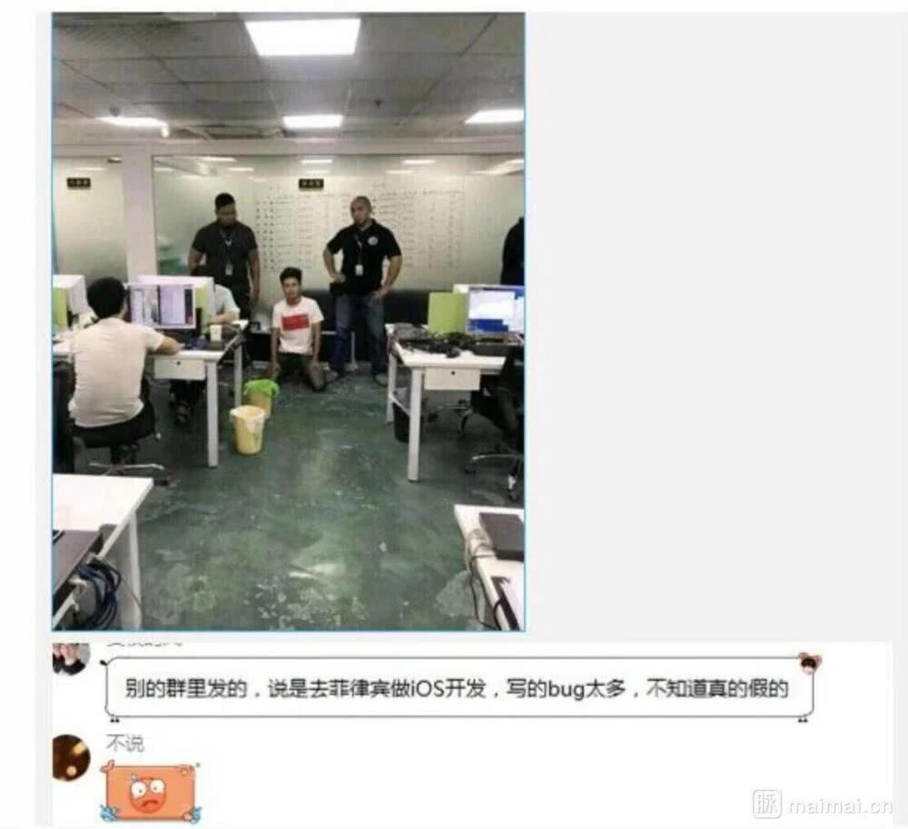
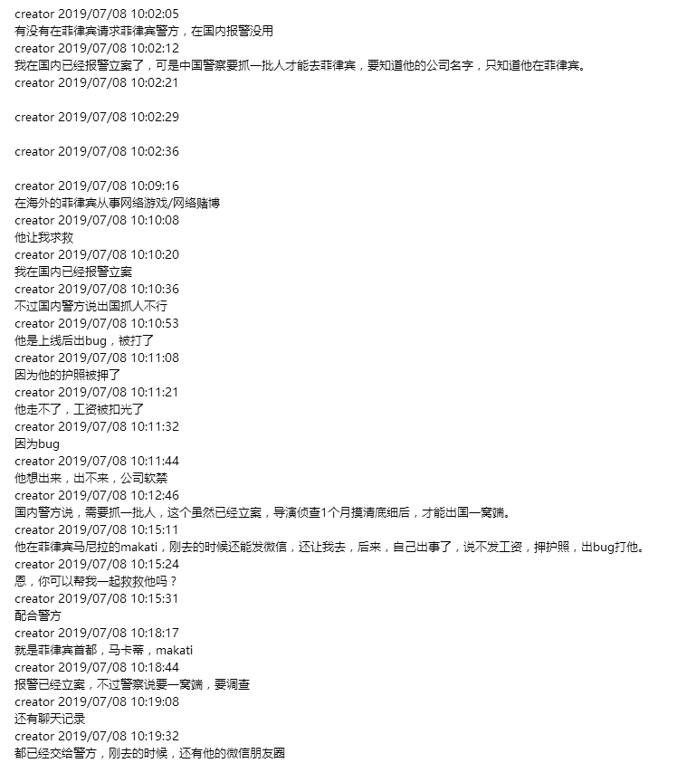

## 关于海外招聘的一些事

其实这个消息早在几周前就在我们群里传开了，但是因为比较忙，我并没有怎么关注。最近在某乎上看到有作者也在曝光这件事，我才又把群里里的消息翻出来看了看。

放几张视频截图和群里的截图

以及他朋友报警的一些消息

### 1
看完感觉很难受，希望警方赶紧去解救我们的同胞

其实在很早以前就有媒体曝光过这些事件，这些公司大都是东南亚搞网上赌博的公司，像菲律宾，印尼，柬埔寨，老挝，马来西亚，缅甸这些地方。

一套完整网络博彩体系的运转，需要大量的程序员来维护，虽然现在能买到现成的代码，但依然需要程序员去进行二次开发和维护，越是暴利的生意，就越会带来大量麻烦，包括架构稳定性到数据库设计到前端可配置到防御攻击到反IP追踪，这些可比一些简单的网站麻烦的多。而这些公司的老板大多都是国内的不法分子为了逃避国家的制裁才跑到国外建立公司运营博彩网站，以赚取暴利。

那么为什么不招本地的程序员而要千里迢迢的招国内的程序呢，我想是因为本地的程序员在技术上符合条件的很少，在管理上也不是很好管理，所以才打起了国内程序员的注意，常言道坑老乡，是最容易的。

而对于我们程序员来说除了技术还有什么是最诱惑人的

钱！！！！当然是钱啊！为了引诱国内程序员，他们通常开出月2W以上的薪酬以及非常的低的技术要求，各种福利和避税政策，而且你在那基本无消费，赚多少存多少，尤其是当前大家都在为首付勒紧自己的钱包的时候，想想在那做个几年存个百来W，然后回国就能美滋滋的过日子，是不是很心动。
### 2
为了加强程序员的信任度，一般第一次面试会是一个甜美女声的HR，会问一些与职业发展，个人生活情感有关的问题，并且语气会特别令人如沐春风，特别诚恳。

虽然很羞耻，但这确实对很多单纯的单身程序员而言是有杀伤力的。

这些个女骗子，也会利用这个机会来用问题试探程序员的心理防范程度。

一般沟通过后，会安排技术面试。

二面往往是男性，聊得也都是技术，一般程序员在这个层面就会完全落入陷阱，因为技术对技术的时候，默认是相信大家是同一个圈子的，尤其是作为面试者，往往本能性地想去征得面试官的认可，这个时候心理防御就会很低。

二面完之后，往往很快一面的HR就会打电话来沟通薪资，然后发offer。

这个offer上会写的很全，包括工资，奖金系数，甚至股权等，就等你确认。

只要你心动了，他会让你以游客的身份去办理签证，去了那边，就掉了坑。
### 3
当你到了东南亚国家后，就会遇到这样的情况。首先，你的护照和身份证，会以被办合同和入职的名义骗走，然后再也拿不回来了。其次，你会发现所谓的做五休二，全都是谎言，你需要每天工作12小时，两班倒，每个月可能会有2到4天的休息。然后，你会发现自己的行踪是被专人监控的，一举一动都有人盯着，包括打电话，与传销非常长相似。最后，发工资的时候，你会发现和许诺的金额不一样，并且可能还是以当地货币结算的，或者干脆只给一点，说剩下的过年给。这时你后悔了，你发现你被骗了，但是一个没有任何外国生活经验的专注与代码中的程序员，应该如何逃脱呢？你想求助，但是谁又能帮你？你在当地人生地不熟，家人朋友远在国外，甚至当地语言你都不一定懂，你能做什么？威胁，辱骂，恐吓，裸体视频，肢体损害，他们有的是方法吓唬你，不要忘了，敢做博彩的人，都不是儒雅随和的人。然后程序员就像黑砖窑里的工人一样，麻木地被逼着输出代码，一天一天的榨干。直到找到机会逃出来。

其实不止有程序员被骗到那里务工，很多都是国内走投无路的底层群体。例如被714高炮吸光血的底层人民，赌狗，他们在国内已经没有了立足之处，下南洋似乎是一个不错的选择。

还有就是现在的无良培训机构，它们与国外的一些赌博公司有勾结，打着入职培训包就业的名义左手骗你的培训费，右手赚博彩公司的推荐费，真的恶心。

东南亚的博彩招聘骗局，骗到的不仅是人的钱财和自由，更多的是骗走了人的信任，和对世界的善意。

很多被骗去的人，反过来又骗国内的人，非常令人痛心疾首。

他们甚至都不敢把这段经历放在自己的简历上，害怕受到歧视，很多一毕业就被培训机构骗过去的人，基本上这辈子毁了一半了，他们甚至无法解释自己刚毕业的这两年在做什么，尤其是背调日益严苛的今天。

### 4
今天我写下这篇文字，就是希望更多人可以看到，骗局本身不复杂，漏洞也不少，只需要稍加注意就可以识破。

更之所以这个简单的骗局这么容易诱人上当，是因为信赖自己的同胞。

信赖自己的同胞不会骗自己。

而实际上，在东南亚开博彩公司的同胞，伙同开培训班的同胞，做猎头的同胞，把大陆的同胞骗来压榨，为的是能够从更多同胞身上榨取更多的金钱。

一条饱蘸同胞之血的利益链，人人都盆满钵满。

这聚宝盆中，是血。

这还是同胞吗？这简直是癌细胞。

事情，不应该是这样子的。

人生，不应该是这样子的。